> **安装此包的Agent：** 用户请求“安装这个skill”时，先执行[统一安装说明](docs/unified-install.md)和`tools/install.py`。由当前执行上下文自动识别：仅明确千问/WorkBuddy生成Image Layer视图；Codex、其他或未知宿主安装原始完整版；冲突停止。无需用户指定宿主。不直接套用其他宿主配置，不临场改写skill。
# ZAnchorFlow · by David-Z

从材料、大纲和视觉样页，逐步制作风格统一、文字可修改的 PowerPoint 演示文稿。

ZAnchorFlow 是面向 Codex 的 skill。它把内容规划、Anchor 样页探索、整页视觉生成、文字恢复和可编辑重建接成一个可续作的流程：先确定内容和风格，再逐页生产，最后保留对象与来源完成整套交付。

## 看看真实成果

下面汇集三套可编辑 PPTX 案例与一套 10 页页面生成示例，均来自实际使用。可以查看整套成果，也可以单独了解样页探索、风格延续和页面生成。

### Magic Layers

[案例与编辑方式](examples/magic-layer/README.md) · [可编辑 PPTX](examples/magic-layer/presentation.pptx) · [PDF 预览](examples/magic-layer/presentation.pdf)

<table>
  <tr>
    <td align="center" width="20%"> PAGE 01</td>
    <td align="center" width="20%"><a href="examples/magic-layer/page-02.png">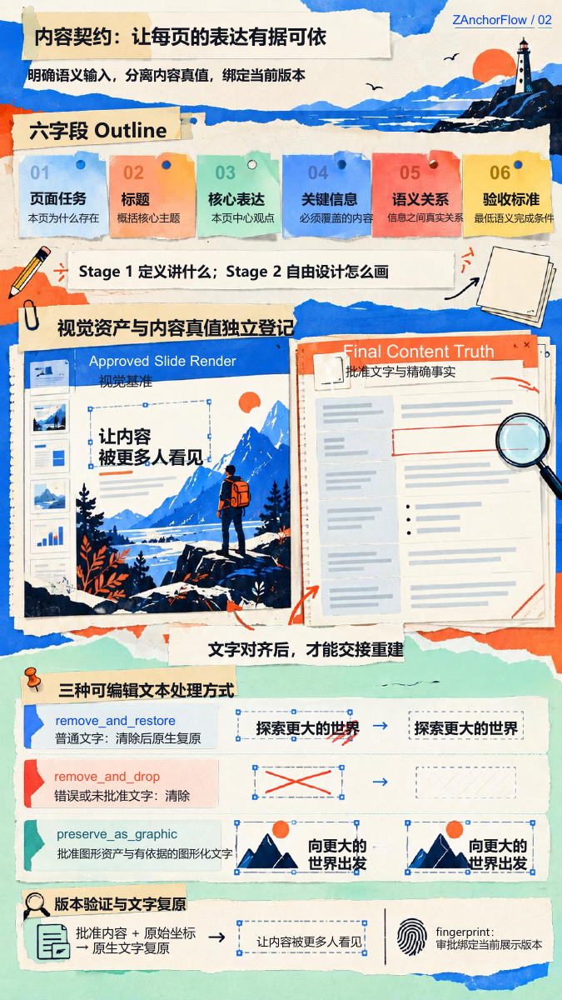</a> PAGE 02</td>
    <td align="center" width="20%"><a href="examples/magic-layer/page-03.png">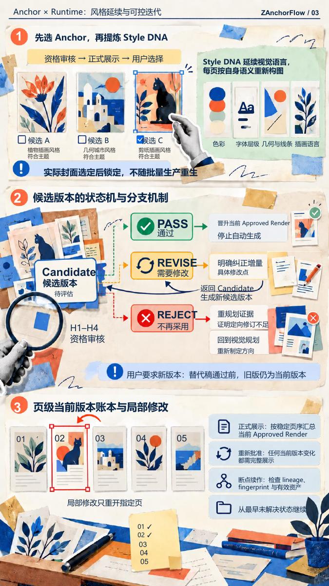</a> PAGE 03</td>
    <td align="center" width="20%"><a href="examples/magic-layer/page-04.png">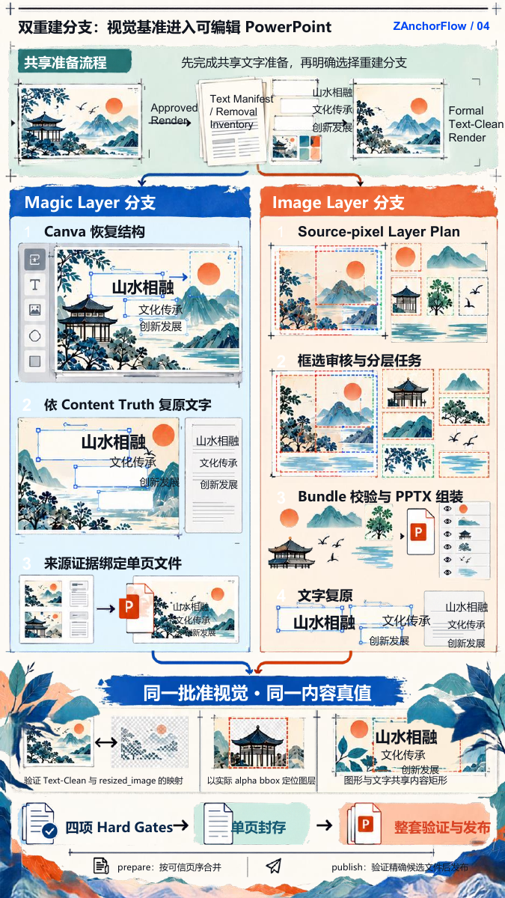</a> PAGE 04</td>
    <td align="center" width="20%"><a href="examples/magic-layer/page-05.png">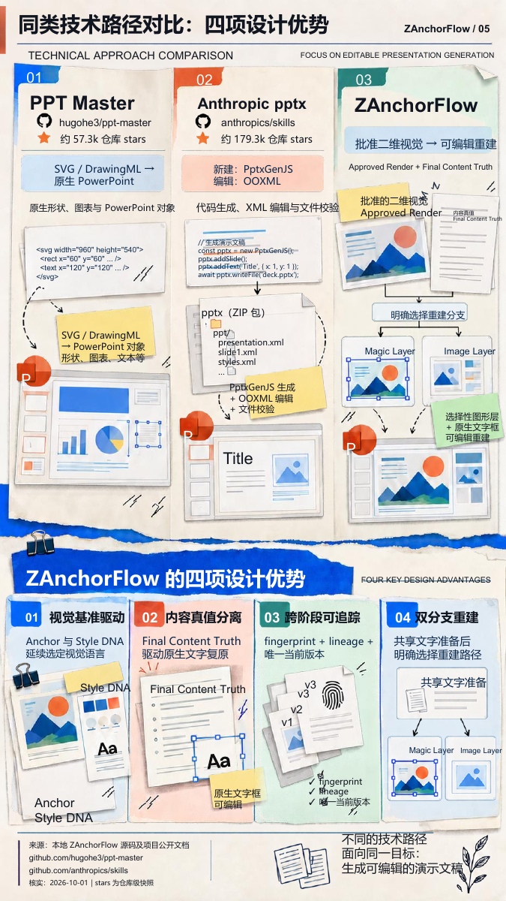</a> PAGE 05</td>
  </tr>
</table>

### Image Layer · 竖向演示

2026-10-02 · 5 页 9:16 · 264 个原生文字框

[案例与编辑方式](examples/image-layer-portrait/README.md) · [可编辑 PPTX](examples/image-layer-portrait/presentation.pptx) · [PDF 预览](examples/image-layer-portrait/presentation.pdf)

<table>
  <tr>
    <td align="center" width="20%"> PAGE 01</td>
    <td align="center" width="20%"> PAGE 02</td>
    <td align="center" width="20%"> PAGE 03</td>
    <td align="center" width="20%"> PAGE 04</td>
    <td align="center" width="20%"><a href="examples/image-layer-portrait/page-05.png">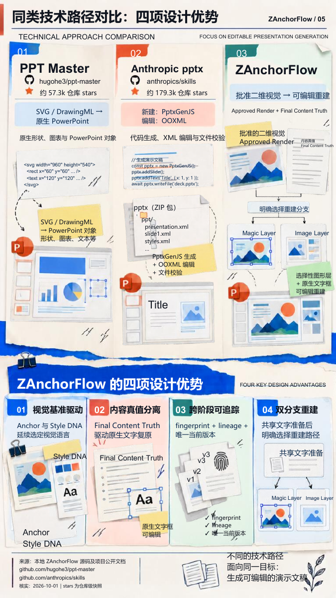</a> PAGE 05</td>
  </tr>
</table>

### Image Layer · 横向演示

2026-10-03—2026-10-04 · 5 页 16:9 · 133 个原生文字对象

[案例与编辑方式](examples/image-layer/README.md) · [可编辑 PPTX](examples/image-layer/presentation.pptx) · [PDF 预览](examples/image-layer/presentation.pdf)

<table>
  <tr>
    <td align="center" width="20%"> PAGE 01</td>
    <td align="center" width="20%"> PAGE 02</td>
    <td align="center" width="20%"><a href="examples/image-layer/page-03.png">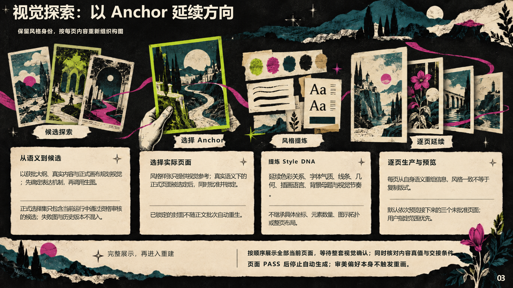</a> PAGE 03</td>
    <td align="center" width="20%"><a href="examples/image-layer/page-04.png">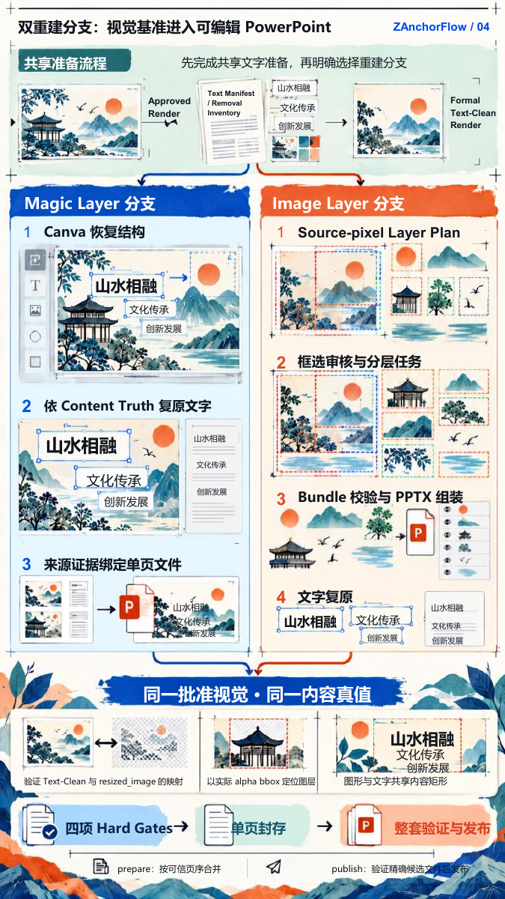</a> PAGE 04</td>
    <td align="center" width="20%"><a href="examples/image-layer/page-05.png">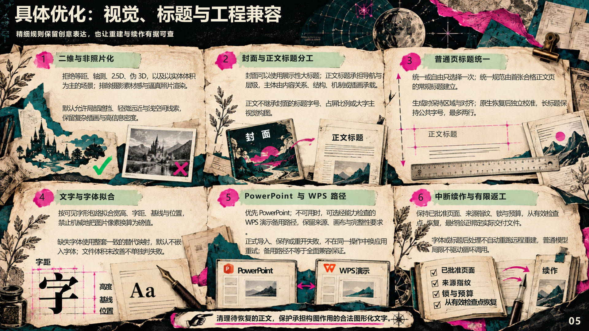</a> PAGE 05</td>
  </tr>
</table>

### 页面生成 · 紫桃视觉织构

2026-10-04 · 10 页横向 PNG 视觉稿 · 五种封面风格探索

本例展示选定 Anchor 后的风格延续与逐页构图，交付形式为 PNG 视觉页面。

[完整 10 页与五种样页探索](examples/page-generation/README.md)

<table>
  <tr>
    <td align="center" width="20%"> PAGE 01</td>
    <td align="center" width="20%"><a href="examples/page-generation/pages/page-02.png">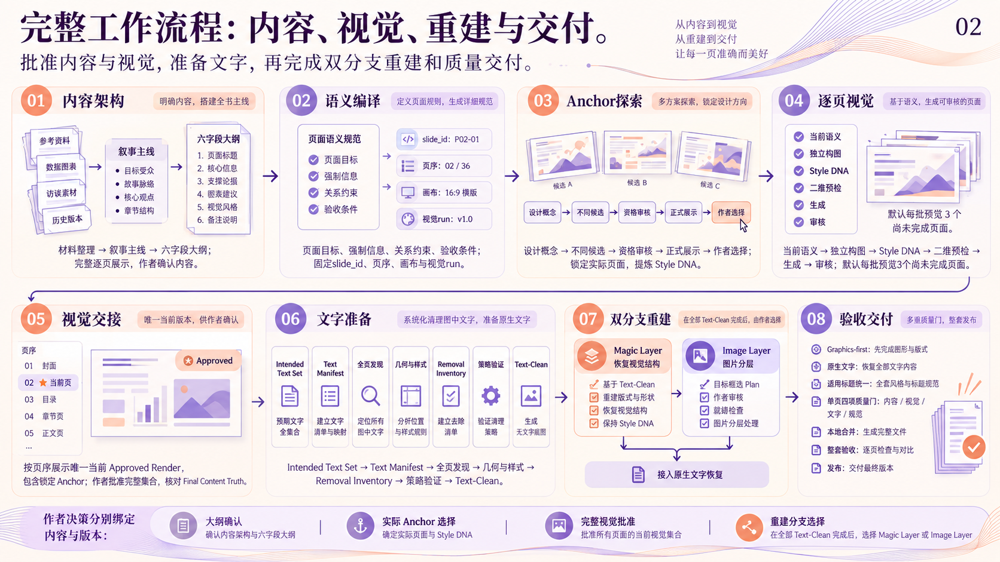</a> PAGE 02</td>
    <td align="center" width="20%"> PAGE 03</td>
    <td align="center" width="20%"><a href="examples/page-generation/pages/page-04.png">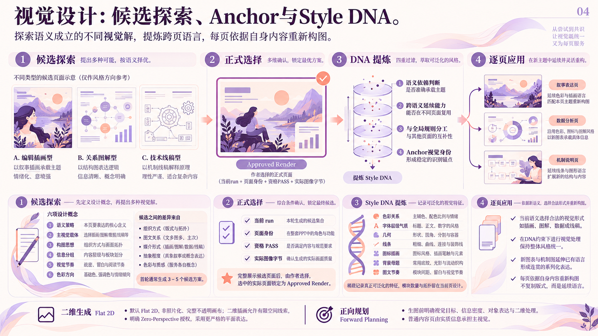</a> PAGE 04</td>
    <td align="center" width="20%"> PAGE 05</td>
  </tr>
  <tr>
    <td align="center" width="20%"><a href="examples/page-generation/pages/page-06.png">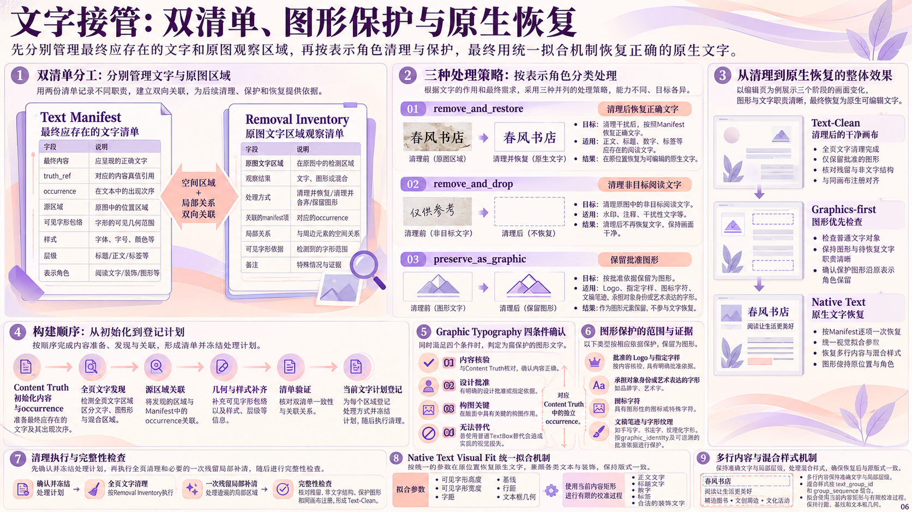</a> PAGE 06</td>
    <td align="center" width="20%"><a href="examples/page-generation/pages/page-07.png">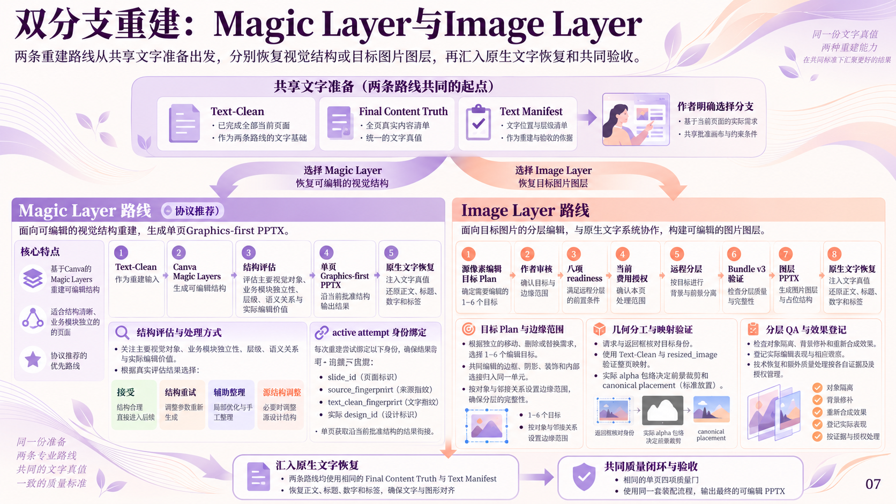</a> PAGE 07</td>
    <td align="center" width="20%"> PAGE 08</td>
    <td align="center" width="20%"><a href="examples/page-generation/pages/page-09.png">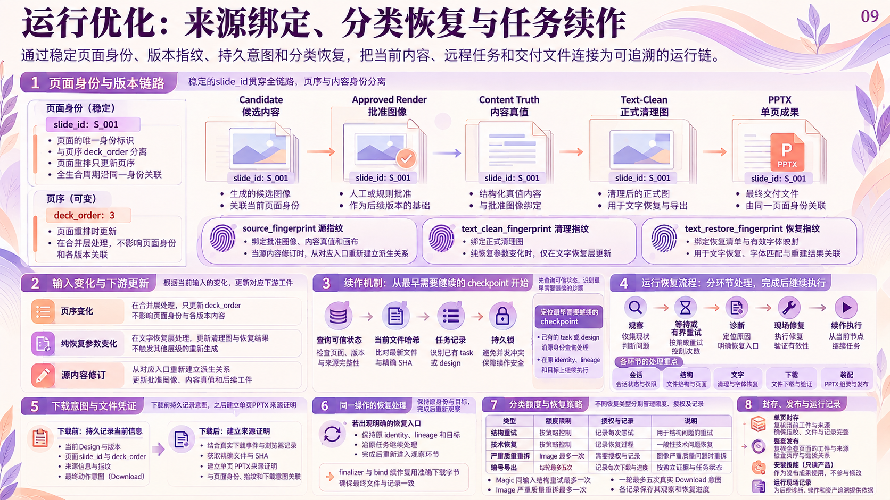</a> PAGE 09</td>
    <td align="center" width="20%"><a href="examples/page-generation/pages/page-10.png">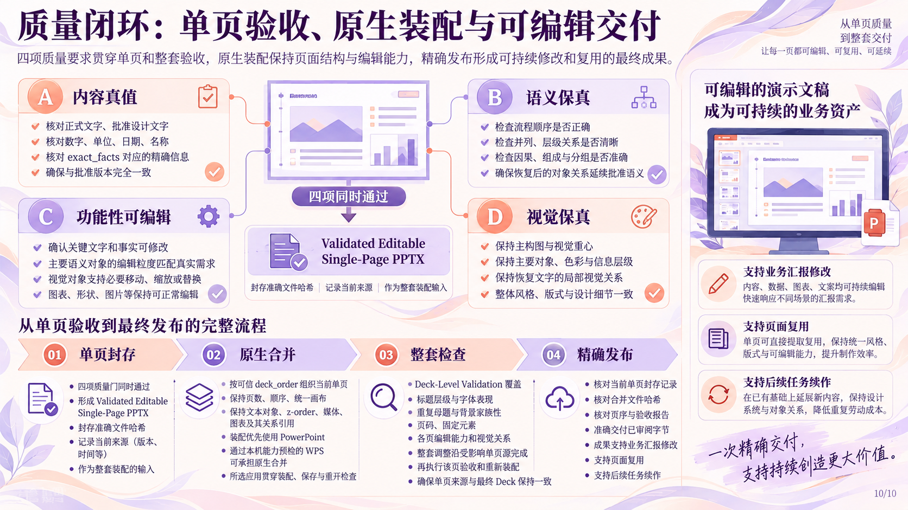</a> PAGE 10</td>
  </tr>
</table>

点击单页图片可查看大图。

Magic Layers 案例恢复了 264 个原生文字框，并按返回对象保留图形结构。Image Layer 竖向案例包含 264 个原生文字框、26 个透明前景图片资产和 5 张背景；横向案例包含 133 个原生文字对象与 29 个图片对象。文字可单独修改，插画按图层资产整体移动、替换或删除。具体编辑单位见各案例页。

Magic Layers 案例制作于 2026-10-01，Image Layer 竖向案例制作于 2026-10-02，横向案例制作于 2026-10-03—2026-10-04。展示与下载均对应各次最终成果；当前 skill 包的程序验证另见开发说明。

## 工作流程

材料 → 内容架构与大纲确认 → 多种 Anchor 样页 → 选定风格与逐页生成 → 文字计划和消字 → 重建路线选择 → 原生文字恢复 → 单页验收、合并和整套交付。

- 内容：明确页面任务、核心表达、关键信息与语义关系。
- 视觉：由选定 Anchor 延续 Style DNA；已验收页面保持锁定。
- 正文标题：可选择统一或自由。统一时，从首个合格普通内容页自动建立标准并供后续页面继承；安全的字号、字体差异先记录，在每页文字恢复后独立调整主标题，整套检查只提示残余差异，不自动返修；封面保持独立，不增加标题标准确认。正文标题承担导航与层级作用，实质内容承担主视觉，作者批准的展示性大标题仅影响该页。
- 文字：使用内容真值、文字计划和 Native Text Visual Fit 恢复可修改文字。
- 续作：根据当前状态及证据恢复，复用已经完成的设计、下载与模型结果。
- 交付：保留页面顺序、资源、对象和来源绑定，合并后检查整套文件。

## 安装与依赖

普通用户下载 [精简安装包 zanchorflow.zip](downloads/zanchorflow.zip) · [SHA-256](downloads/zanchorflow.zip.sha256)；开发者 [下载当前源码](https://github.com/skd-zhaodeyu/ZanchorFlow/archive/refs/heads/main.zip)。把解压后的任意一个包交给当前 Agent，直接请求“安装这个 skill”。安装者按[统一安装说明](docs/unified-install.md)运行 tools/install.py，不要求用户指定宿主。

`dist/zanchorflow.zip` 和其 SHA-256 是不可变的原始完整版基准。自动安装只从该基准生成；不要绕过统一入口，直接复制源码中的技能目录给千问或 WorkBuddy。两包内容和构建方式见[两包发布](docs/release-packages.md)。原有 Codex 依赖和技能使用说明仍见[安装说明](zanchorflow/docs/installation.md)。

Python 基础依赖：
~~~powershell
python -m pip install -r zanchorflow/requirements-base.txt
~~~
Image Layer 另使用 requirements-image.txt。原生整套合并需要 Windows 桌面 PowerPoint 或通过能力预检的 WPS 演示，以及 requirements-office.txt；默认优先 PowerPoint，WPS 为备用。执行 agent 仅在当前步骤实际缺少 Python 或必要依赖时说明准备工作，不固定开场提醒。已验证的版本组合、预检命令和独立试用方法见安装说明；不安装也可让 Codex 读取解压目录的 SKILL.md 开始测试。

## 第一次使用

在有原始材料的独立项目中，可以这样请求：

> 使用 ZAnchorFlow，将这份材料制作成 5 页中文演示文稿。先规划内容大纲，再提供三种真正不同的样页，选定后延续整套风格。所有状态与成果保存到独立项目目录。

Codex 会按当前步骤读取规范，并在大纲、样页选择、页面正式展示和重建路线等现有确认点与你协作。

## 两条重建路线

**Magic Layer 分支（推荐）**：使用 Canva 实际可用的 Magic Layers，取得并验证 PPTX，再恢复原生文字。支持已批准的受控等比例画布映射与下载恢复。

**Image Layer 分支**：在消字后的页面上形成 Layer Plan，通过图像分层模型返回独立图片资产，再按批准画布重建、恢复原生文字。按实际选框保留编辑分组，940/941 等小幅源尺寸差异通过通用的每轴 5 源像素规则处理。

Image Layer 真实提交前需配置 ZANCHORFLOW_360_API_KEY，核实当前账户权益、余额与价格并确认费用授权。密钥只放执行进程环境，不能进入文件或日志。

## 续作与更新

让 Codex 读取当前 SKILL.md 和独立项目状态，使用 status 定位下一步；保留原身份、锁、预算和文件，复用已完成结果。

包名和调用名始终为 zanchorflow。新旧通过 manifest 的 updated_at_utc 和 ZIP SHA-256 区分。原有协议文件名、格式版本和来源兼容字段保留，不新增发布版本号。

## 开发与测试

源码保留完整测试；精简安装包采用白名单构建。Windows CI 执行无需 Office 的离线回归、包完整性和公开内容检查。本地 Office 测试另验证合并、实际编辑、保存及重新打开。

查看 [开发与验证](docs/development.md)。测试结果按程序测试、Office 集成和远程实际行为分别记录，不用测试数量替代功能覆盖。

## English

ZAnchorFlow is a Codex skill for turning source material into a coherent, editable PowerPoint deck. It connects content planning, approved visual anchors, page generation, text restoration and two reconstruction routes: Canva Magic Layers and Image Layer assets.

Download the fixed-name installation ZIP, check its SHA-256, and follow the installation guide. The source repository includes development tests; the slim ZIP retains the complete runtime. Updates are identified by an internal UTC timestamp and archive hash.

## License

[MIT](LICENSE) · David-Z. Third-party services and materials retain their own terms. No third-party fonts or model source code are bundled.

当前交付为 **V1.0**；包名和调用名不变，同版本更新以内部更新时间区分。Image Layer 按编辑价值选框，差结果如实记录且不自动重新分层。包内版本、安装版本和哈希可用安装器核对；历史 RC 信息只用于来源追溯。

### 支持作者

如果 ZAnchorFlow 对你有帮助，欢迎自愿打赏。感谢支持。

