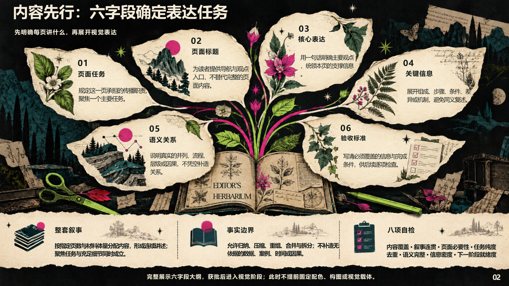

# Image Layer 真实案例

制作日期：2026-10-03—2026-10-04。

这次真实使用完成 5 页 16:9 横向的 ZAnchorFlow 介绍，以奶油纸、虫洞与拼贴插画延续整套风格。最终 PPTX 包含 **133 个原生文字对象、29 个图片对象**；标题、正文和页码可单独修改，插画按图层资产整体移动、替换或删除。

[可编辑 PPTX](presentation.pptx) · [PDF 预览](presentation.pdf) · [PPTX SHA-256](presentation.pptx.sha256)

<table>
  <tr>
    <td align="center" width="20%"> PAGE 01</td>
    <td align="center" width="20%"> PAGE 02</td>
    <td align="center" width="20%"> PAGE 03</td>
    <td align="center" width="20%"> PAGE 04</td>
    <td align="center" width="20%"> PAGE 05</td>
  </tr>
</table>

点击单页图片可查看大图。

## 五页内容

1. 从内容构思到可编辑演示。
2. 内容先行：用六字段确定页面任务。
3. 视觉探索：让 Anchor 延续风格。
4. 双分支重建：Magic Layer 与 Image Layer。
5. 具体优化：视觉生成规则与工程闭环。

## 代表页面与编辑单位

第 2 页包含 **30 个原生文字对象和 5 个图片对象**。六字段标题和说明文字可逐项修改，六叶书本插画等资产可独立选中与移动。

29 个图片对象包含 23 个模型前景、5 张背景和 1 个从批准原图恢复的字形资产。该字形保留原来的造型，作为图片对象编辑。插画的内部线条仍属于对应图片资产；部分图层移动后可见背景残影或边缘变化。

## 文件核验

本次更新重新从最终 PPTX 导出五页预览和 PDF，并使用 PowerPoint 只读重新打开；公开副本与指定原文件的五页渲染逐像素一致。对象数量以最终文件实际统计为准。

公开副本只清理个人文档属性，幻灯片、字体、图片资源和对象结构保持。展示保留最终成果，不包含原对话、运行状态或中间调试材料。
