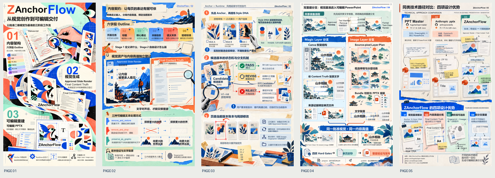

# Magic Layers 真实案例

使用日期：2026-10-01。

该次真实使用完成 5 页 9:16 演示，恢复 264 个原生文字框，图形和图标按 Magic Layers 实际返回对象组织。原记录包含原生 PowerPoint 合并、重新打开和整套渲染验证。

[可编辑 PPTX](presentation.pptx) · [PDF 预览](presentation.pdf)

## 代表页面与编辑单位

本页有 46 个独立原生文字框。图形按 Magic Layers 返回的各个对象编辑，可在 PPTX 中单独选择；保留返回结构，不把它们统称为全部原生矢量。

本案例展示当次最终成果，保留其实际编辑单位；不等同于当前修订包重新完成了远程全流程测试。竞品星标为页面注明的 2026-10-01 仓库级快照。

公开副本仅清理私人元数据、备注和外链，页面、图像资产及对象结构保持；没有增加署名水印或 PPT 属性。
