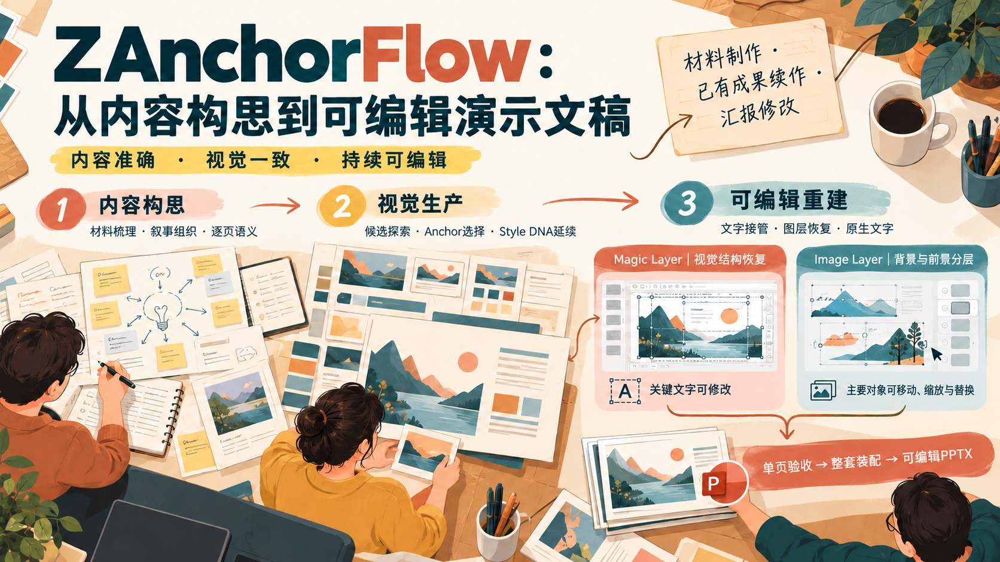
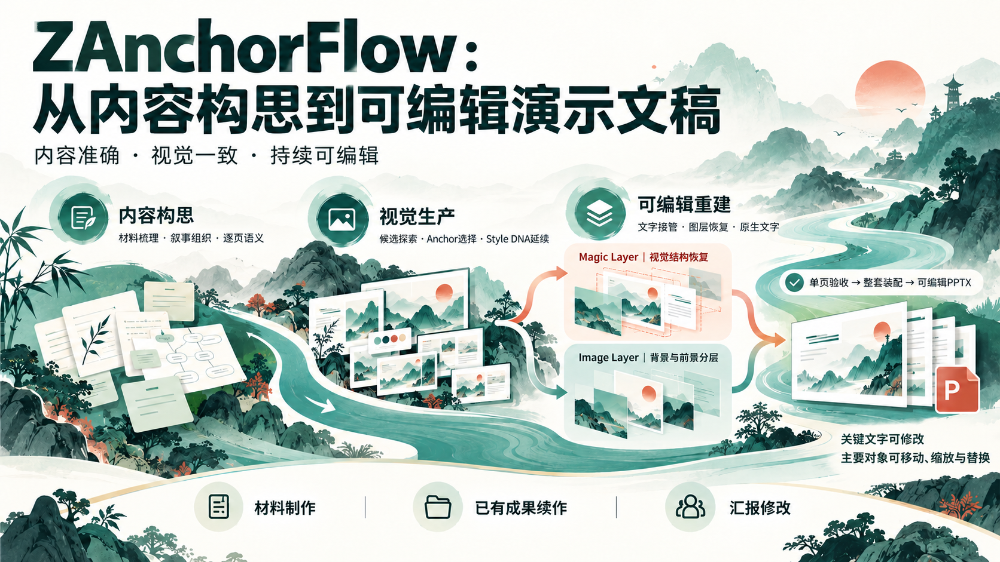
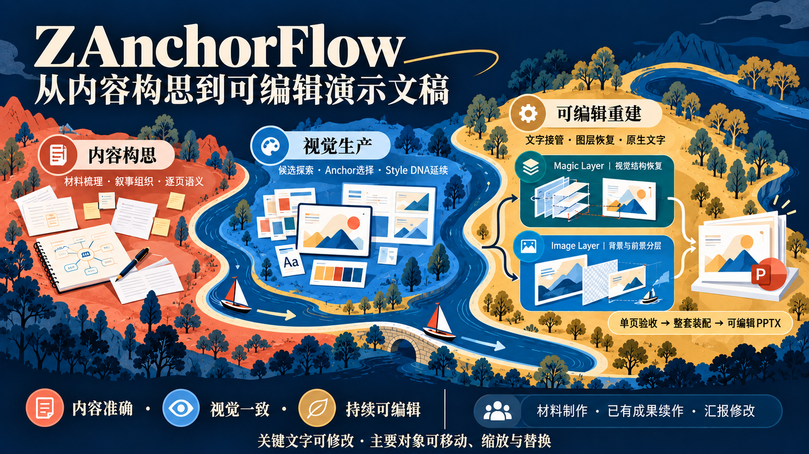

# 页面生成示例｜紫桃视觉织构

制作日期：2026-10-04。展示阶段：**页面生成 · PNG 视觉稿**。

本例以同一份封面内容探索五种风格，选定 D「视觉织构」作为实际封面与整套 Anchor，再延续紫桃配色、织构线条、插画和统一标题区域，完成 10 页横向视觉页面。每页根据内容重新组织流程、关系和信息结构。

本页展示 PNG 页面与风格探索；完整可编辑 PPTX 成果另见 [Magic Layers](../magic-layer/README.md)、[Image Layer 竖向](../image-layer-portrait/README.md) 和 [Image Layer 横向](../image-layer/README.md) 案例。

## 整套 10 页

点击单页图片查看原尺寸 PNG。

<table>
  <tr>
    <td align="center" width="20%"> PAGE 01</td>
    <td align="center" width="20%"> PAGE 02</td>
    <td align="center" width="20%"> PAGE 03</td>
    <td align="center" width="20%"> PAGE 04</td>
    <td align="center" width="20%"> PAGE 05</td>
  </tr>
  <tr>
    <td align="center" width="20%"> PAGE 06</td>
    <td align="center" width="20%"> PAGE 07</td>
    <td align="center" width="20%"> PAGE 08</td>
    <td align="center" width="20%"> PAGE 09</td>
    <td align="center" width="20%"> PAGE 10</td>
  </tr>
</table>

## 同一封面的五种风格探索

五种方案使用同一组内容，分别探索几何路径、创作场景、水墨长卷、织构隐喻和语义地图。D 用于本套 10 页；其余方案展示不同的视觉方向。

<table>
  <tr>
    <td align="center" width="20%"> A｜几何动势</td>
    <td align="center" width="20%"> B｜创作工坊</td>
    <td align="center" width="20%"> C｜水墨长卷</td>
    <td align="center" width="20%"> D｜视觉织构（选用）</td>
    <td align="center" width="20%"> E｜语义地图</td>
  </tr>
</table>

## 逐页大图

### 01｜封面：从内容构思到可编辑演示文稿

### 02｜完整工作流程：内容、视觉、重建与交付

### 03｜内容架构：六字段契约与充实的页面表达

### 04｜视觉设计：候选探索、Anchor 与 Style DNA

### 05｜视觉交接：页面资格、作者确认与内容真值

### 06｜文字接管：双清单、图形保护与原生恢复

### 07｜双分支重建：Magic Layer 与 Image Layer

### 08｜专项优化：标题契约、字体策略与画布映射

### 09｜运行优化：来源绑定、分类恢复与任务续作

### 10｜质量闭环：单页验收、原生装配与可编辑交付

